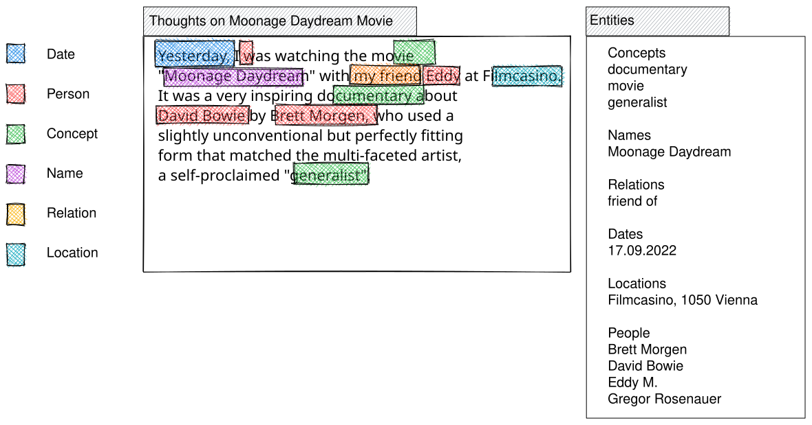

[[Gregor Rosenauer]]

## Motivation and Vision Statement

* Although the idea behind personal knowledge graphs dates back to the 1960s with the now famous Zettelkasten method by Luhmann [xx](yy), it only became popular in recent years with the introduction of connected note taking tools like Evernote, Notion, Roam or Obdisian, to name only a few.

* On the other hand, there is raising criticism in the usefulness of this approach [xxx](yy), as a graph does not make one any wiser per se, and connections alone do not bring much new insights beyond the fact that the linked information is connected somehow. Without an additional classification on how and why some bits of information are connected, users cannot gather meaningful output, as they cannot navigate and query based on the depth of knowledge they gathered, confined to see only on shallow connections on the surface.

* Also, not everything can or should be captured in note-taking applications and handled via cloud services, as sophisticated as they may have become.

  * current linked note-management applications mostly rely on simple tagging, which looses semantics and restricts later search and navigation.

  * cloud providers either charge recurring fees or utilize user data, which can even pose a threat to users in unsafe environments and is not suitable for sensitive or business data (possible infringement of intellectual property, transfer of copyright to the provider, etc.).
  
* A lot of valuable information is still locally stored on personal desktop systems in the form of carefully selected documents, ebooks, papers or other media, possibly restricted or private sources, and personal artifacts like project notes, ideas, concepts, or drafts.

* personal knowledge graphs should also cover all kinds of information, not only document or media entities, but also various communication (mails), contacts and events (conferences, meetings, etc.) already present in the user's environment, and highly connected to personal data and work that derives from it.

* A truly personal knowledge graph needs to live "on the edge", i.e. the user's system, it needs to embrace that existing information, understand its connections, make them visible to the user and allow to navigate and query it.

## A Vision for a Personal Knowledge Graph based on the Semantic Desktop

-- Wise up your Workspace - Why a Personal Knowledge Graph should live in your File System

* The most natural and feasible way to implement such a system would be to utilize a modern OS that provides a semantic filesystem, with attributes and relations built-in.

* Although many modern filesystems now support custom attributes as key/value pairs, they still don't allow to query for them (there is an experimental patch to make the `find` command support this <<REF!>>), and there is no support for relations, reducing their use to static metadata for display in info panels.

* Instead of implementing query support and native support for relations beyond simple links directly in the filesystem layer, current semantic desktop solutions introduce a separate data storage like embedded sql databases, adding a lot of overhead and introducing data synchronization issues. They often introduce complex API`s that are more aligned to the semantic web than the desktop, which makes development harder than needed and slows down adoption and user acceptance <<REF!>>.

* More ambitious efforts in file system development failed because of similar complexity , trying to integrate a full-fledged database into a desktop OS intended for everyday use.

* So an ideal solution should be lightweight and integrate transparently and naturally with the desktop the user knows and operates daily, built on a file system that supports semantic queries or can be extended with minimum overhead.

* SEN ("Semantic ExteNsions") follows this approach by utilizing and extending the rich infrastructure and API already provided by Haiku, the most prominent open-source descendant of BeOS . Files naturally represent entities, as the type system is based on MIME types, properties of entities are stored in custom filesystem attributes, only relations have been omitted because the original creators of BeOS identified the same fallacies outlined above (the first version of the OS still had a Table and Relations API though).

* SEN circumvents this by also storing relations in file system attributes, similar to properties, and providing a very thin, message-based API to bridge this extension of the base OS.

* For performance, any file that is part of a relation gets a unique and stable identifier (like an object ID), and relations reference this ID in a single custom attribute. Because both the object ID of the source (file) and the relation IDs of the target files are stored in indexed attributes, they can be queried very efficiently.

* Relation properties are stored in additional attributes that need not be indexed, as they are retrieved on demand in near real time. They are stored in separate attributes as a map of relation property key/values for each relation.

## How to Build it: The Pillars of the Proposed Solution

### Design Philosophy and Core Principles

1. *simple:* KISS, SEN is not an expert system, but targeted at personal desktop and average users: should gradually and transparently provide more advanced functionality as needed and understood
1. *unobtrusive:* should not impact system performance and resources notably
1. *transparent:* should integrate with desktop and common metaphors, working directly on files, folders, filetypes and attributes - extensions to desktop (file manager, behavior) only where needed (e.g., to integrate new concept of relations)
1. *open but private:* system should be open for extension, but personal data is kept private and does not leave the personal system: extension through plugins (e.g., for extracting attributes and entities from files), for importing data (e.g., ontologies or individual entities from schema.org), and for exchanging data where explicitly requested (linked data between users).

### Learning from the Past: A short history of promises and failures of the Semantic Desktop

-> will be largely rewritten and compacted to focus on current solution and only refer to past or related projects where needed.

    * The Role of Metadata in Filesystem Design - From Acorn to UNIX
    basic support and OS usage of metadata was already there in the 1990s, cf Amiga FileNotes used in web browser IBrowse for storing originating web site for downloads
    * Promising Concepts: Nepomuk and Baloo
    * Problems with Current Solutions
        * Falling into the Complexity Trap
            * Applying Semantic Web Standards to the Desktop
            many projects failed because they tried to build the entire complexity of the semantic web for personal knowledgge graphs, which is not really feasible or sustainable, see e.g. https://www.gnu.org/software/gnowsys/
            * Leaky Abstractions: Missing Usability
        * Neglecting the Performance Impact
        * Missing Query Functionality
    * BeOS - The First Entity-Based Desktop
        * "GraphOS"
        * Entities, not Files
        * Universal Interoperability through Custom Attributes
        * Metadata Queries
        * already very advanced user-centric, worked well in everyday use, but failed to gain enough traction to survive

## Introducing SEN - a modern minimalist user-centric approach

### Haiku - the Perfect Prototyping Environment

* short description with references
* picks up concepts from BeOS for filesystem based metadata handling and search
* see also Graph/Entity OS by Alexander Obenauer

### Basic Architecture

* system daemon and core implementation for interacting with file system
* thin message-based API for integrating with applications including the standard file browser (called "Tracker" in Haiku)

### Relations - the missing Link

* corner stone of the proposed solution, storing relations between files, along with relation properties, in filesystem attributes:
  * `SEN_ID`: unique ID (like an Object ID in document storage systems), simplified as small numbers below, but is really a UUID.
  * `SEN_REL_TARGETS`: comma-separated SEN_ID's of referenced files
  * `SEN_REL:\<ID>:\<LABEL>`: properties of relation with label 'LABEL' to target with SEN_ID 'ID' as a key/value map ('BMessage' type in Haiku)

### Example PKG: Books, Authors and Publishers

* simple graph from 3 entities: Book, Author and Publisher

* File "Book of SEN.md":

| SEN_ID | SEN_REL_TARGETS | SEN_REL:0815:authoredBy | SEN_REL:4711:publishedBy  | (standard file attributes)... |
|:-------|:----------------|:------------------------|:--------------------------|:------------------------------|
| 123    | 0815,4711       | role:author             | role:publisher            |                               |

* File "Gregor Rosenauer":

| SEN_ID | SEN_REL_TARGETS | SEN_REL:123:authors | (standard file attributes)... |
|:-------|:----------------|:--------------------|:------------------------------|
| 0815   | 123             | role:author         |                               |

* File "Writer's Block":

| SEN_ID | SEN_REL_TARGETS | SEN_REL:123:publishes          | (standard file attributes)... |
|:-------|:----------------|:-------------------------------|:------------------------------|
| 4711   | 123             | role:publisher,date:01/12/2022 |                               |

| SEN_ID | SEN_REL_TARGETS | SEN_REL:123:signs | SEN_REL:123:pays                     | (standard file attributes)... |
|:-------|:----------------|:------------------|:-------------------------------------|:------------------------------|
| 4711   | 0815            | date:31/12/2022   | amount:100 EUR,targetDate:31/12/2022 |                               |

* another example with referencing documents and related annotations:

* File "Lorem ipsum.txt":

| SEN_ID | SEN_REL_TARGETS | SEN_REL:2412:annotatedBy | (standard file attributes)... |
|:-------|:----------------|:-------------------------|:------------------------------|
| 1130   | 2412            |                          |                               |

| SEN_ID | SEN_REL_TARGETS | SEN_REL:1130:annotates      | (standard file attributes)... |
|:-------|:----------------|:----------------------------|:------------------------------|
| 2412   | 1130            | offsetStart:65,offsetEnd:79 |                               |

* navigation through OS-supported filesystem queries, may be intercepted and enriched by SEN (resolving placeholders or allowing to search relations and their properties)

## Desktop Use Cases and Examples - Re-modelling standard applications with SEN

### Calendar

* using Event files and Relations for connecting events based on sequence and time (navigating between recurring events or a daily/weekly agenda)
* we can then build a simple "Today" view from a query for all Events on a given date, even filtered by tags or participating contacts, which are also files)
  * clicking on a "calendar" icon in the desk bar (application launcher and info panel) would open a Tracker window with all event files having an event date of today.
  
### E-Mail

### Notes: UNO - a Concept for a Universal NOtebook

* Simple but Semantic
* also suitable for story writing: characters, locations and story arch as (self-)references
* Features and Use Cases - Authoring system (Relation Views for self-relations (structure, internal links to entities in the text) and external references)
* Prototype Concept:

* in the file-browser, all extracted entities can be browsed by navigating the file's relations:

### Extending a Code Editor into an IDE

* adding semantic structuring and navigation using SEN
* self-relations for, e.g., methods and classes
* external relations for included files (C/C++) or referenced classes (Java imports)
* can be realised on top of existing application(s) using SEN API, or even (more as a showcase) using the SEN enabled file browser.

## Outlook, Ongoing and Future Work

* Integrating Information Extraction and Document Analysis
* Building Dynamic Relations: lazily evaluated when user navigates them, used for expensive and volatile relations e.g. for "similar" files
* Rules and Inference of Relations and Attributes
* Further Desktop Extensions:
  * rich Tracker views, e.g. 2d-axis view for arranging items on a timeline, or by proximity etc.
