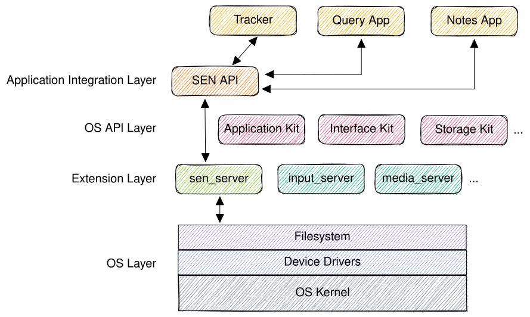
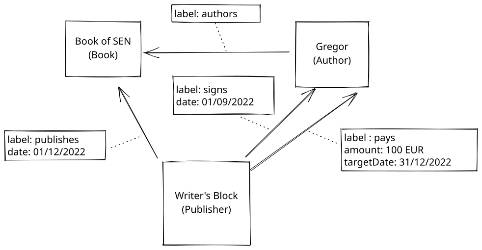
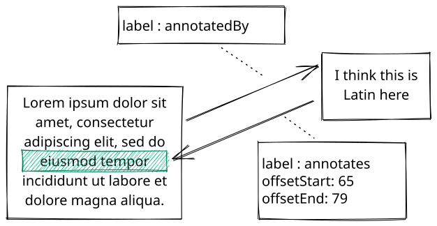
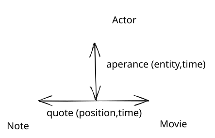
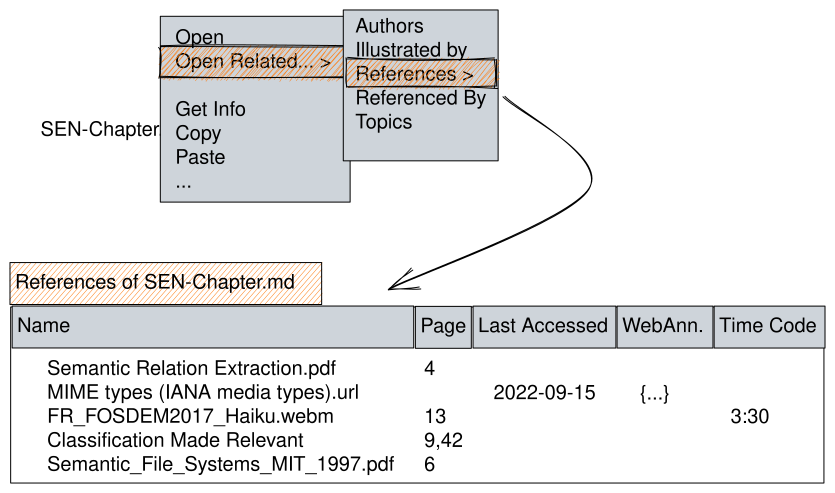
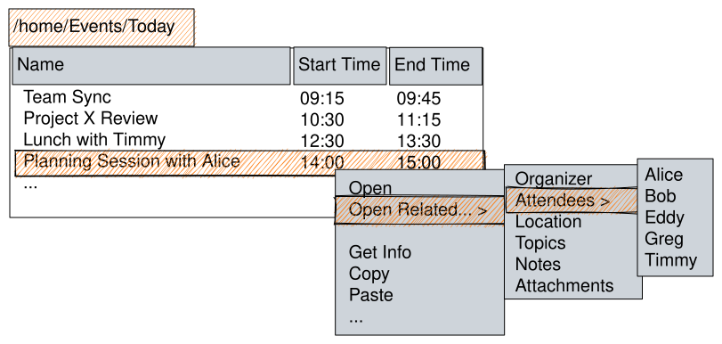
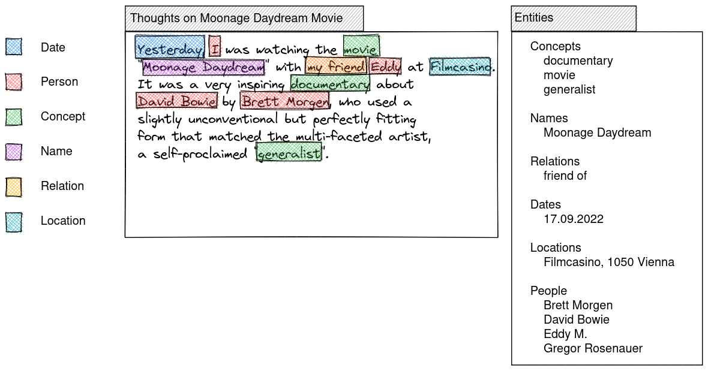
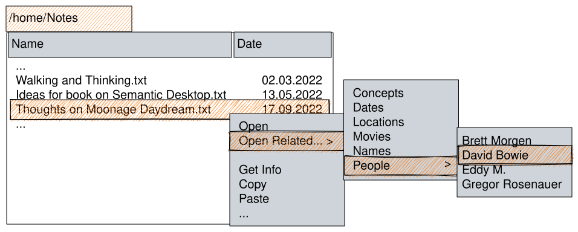
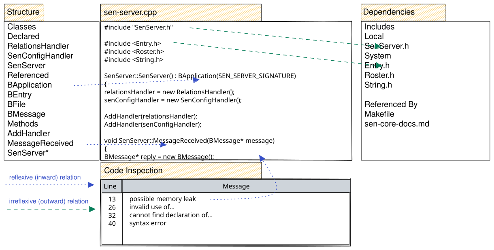

[[Gregor Rosenauer]]

## Motivation and Vision Statement

* Although the idea behind personal knowledge graphs dates back to the 1960s with the now famous Zettelkasten method by
  Luhmann (Schmidt, 2018), it only became popular in recent years with the introduction of connected note-taking tools 
  like Evernote, Notion, Roam (and its open source cousin Foam (foambubble, 2022)) or Obdisian, to name only a few.
* On the other hand, there is also valid criticism in the usefulness of this approach (see chapter 9 in this book on
  "A decentralised social network of Solid-based second brains" by Mathew Lowry), as a graph does not make one any wiser 
  per se, and connections alone do not bring much new insights beyond the fact that the linked information is connected somehow.
  Also, current systems of this kind only use tagging, which is the simplest form of classification, but does not hold
  any deeper semantics to allow meaningful identification of entities and their properties and relations.
  Without an additional classification on how and why some bits of information are connected, users cannot gather meaningful output,
  as they cannot navigate and query based on the depth of knowledge they gathered, confined to see only on shallow,
  labelled connections on the surface.
* Also, not everything can or should be captured in note-taking applications and handled via cloud services, as sophisticated as they may have become.
  * these services limit what users can do with their data, and without the service, which is bound to a single vendor,
    the data mey become inaccessible or unusable, at least connections and navigation are then lost.
  * cloud providers either charge recurring fees or utilize user data, which can even pose a threat to users in unsafe 
    environments (like journalism or activism), and is not suitable for sensitive or business data (possible infringement 
    of intellectual property, transfer of copyright to the provider, etc.).
* A lot of valuable information is still locally stored on personal desktop systems in the form of carefully selected documents, 
  ebooks, papers or other media, possibly restricted or private sources, and personal artifacts like project notes, ideas, concepts, or drafts.
* personal knowledge graphs should also cover all kinds of information, not only document or media entities, but also various 
  communication (mails), contacts and events (conferences, meetings, etc.) already present in the user's environment, and 
  highly connected to personal data and work that derives from it.
* A truly personal knowledge graph needs to live "on the edge", i.e. the user's system, it needs to embrace that existing
  information, understand its connections, make them visible to the user and allow to navigate and query it.

## A Vision for a Personal Knowledge Graph based on the Semantic Desktop

-- Wise up your Workspace - Why a Personal Knowledge Graph should live in your File System

* The most natural and feasible way to implement such a system would be to utilize a modern OS that provides a semantic 
  filesystem, with attributes and relations built-in.
* Although many modern filesystems now support custom attributes as key/value pairs, they still don't allow to query 
  for them (there is an experimental patch to make the `find` command support this <<REF!>>), and there is no support for
  relations, reducing their use to static metadata for display in info panels.
* Instead of implementing query support and native support for relations beyond simple links directly in the filesystem layer, 
  current semantic desktop solutions introduce a separate data storage like embedded sql databases, adding a lot of overhead 
  and introducing data synchronization issues. They often introduce complex API`s that are more aligned to the semantic web 
  than the desktop, which makes development harder than needed and slows down adoption and user acceptance <<REF!>>.
* More ambitious efforts in file system development failed because of similar complexity, trying to integrate
  a full-fledged database into a desktop OS intended for everyday use (see "History" section below).
* So an ideal solution should be lightweight and integrate transparently and naturally with the desktop the user knows 
  and operates daily, built on a file system that supports semantic queries or can be extended with minimum overhead.
* SEN ("Semantic ExteNsions") follows this approach by utilizing and extending the rich infrastructure and API already 
  provided by Haiku, the most prominent open-source descendant of BeOS . Files naturally represent entities, as the 
  type system is based on MIME types, properties of entities are stored in custom filesystem attributes, only relations 
  have been omitted because the original creators of BeOS identified the same fallacies outlined above (the first version
  of the OS still had a Table and Relations API though).
* SEN circumvents this by also storing relations in file system attributes, similar to properties, and providing a very 
  thin, message-based API to bridge this extension of the base OS.
* For performance, any file that is part of a relation gets a unique and stable identifier (like an Object ID in a 
  document management system or database), and relations reference this ID in a single custom attribute. Because both the 
  Object ID of the source (file) and the relation IDs of the target files are stored in indexed attributes, they can be queried very efficiently.
* Relation properties are stored in additional attributes that need not be indexed, as they are retrieved on demand in near 
  real time. They are stored in separate attributes as a map of relation property key/values for each relation.

## How to Build it: The Pillars of the Proposed Solution

### Design Philosophy and Core Principles

1. *simple:* KISS, SEN is not an expert system, but targeted at personal desktop and average users: should gradually and transparently provide more advanced functionality as needed and understood
1. *unobtrusive:* should not impact system performance and resources notably
1. *transparent:* should integrate with desktop and common metaphors, working directly on files, folders, filetypes and attributes - extensions to desktop (file manager, behavior) only where needed (e.g., to integrate new concept of relations)
1. *open but private:* system should be open for extension, but personal data is kept private and does not leave the personal system: extension through plugins (e.g., for extracting attributes and entities from files), for importing data (e.g., ontologies or individual entities from schema.org), and for exchanging data where explicitly requested (linked data between users).

### Learning from the Past: A short history of promises and failures of the Semantic Desktop

-> will be largely rewritten and compacted to focus on current solution and only refer to past or related projects where needed.

    * The Role of Metadata in Filesystem Design - From Acorn to UNIX
    basic support and OS usage of metadata was already there in the 1990s, cf Amiga FileNotes used in web browser IBrowse for storing originating web site for downloads
    * Promising Concepts: Nepomuk and Baloo
* also tried in mainstream OS but failed, see Microsoft's WinFS (LSoft Technologies Inc., 2022), see also a critical but 
  insightful discussion in (Orlowski, 2002) by the developers of the more successful and actually realised BeOS File System BFS, see below.
* Problems with Current Solutions
        * Falling into the Complexity Trap
            * Applying Semantic Web Standards to the Desktop
            many projects failed because they tried to build the entire complexity of the semantic web for personal knowledgge graphs, which is not really feasible or sustainable, see e.g. https://www.gnu.org/software/gnowsys/
            * Leaky Abstractions: Missing Usability
        * Neglecting the Performance Impact
        * Missing Query Functionality

### BeOS - The First Semantic Desktop OS

* history (Pinheiro, 2020)
* Entities, not Files
* Universal Interoperability through Custom Attributes - no specialised applications needed for simple CRUD operations
* Metadata Queries
* already very advanced user-centric, worked well in everyday use, but failed to gain enough traction to survive
* rather unknown niche OS, but closest to the "GraphOS" outlined in (Alexander Obenauer, 2021), which proposes an "entity-first"
  operating system with related concepts:
> In the Graph OS, all of your things are within your system as nodes, or items, within your graph. Emails, calendar events,
> articles, web pages, podcast episodes, to do lists as well as the to dos inside them; everything. And each thing may have
> references to, or be referenced by, any other thing.

## Introducing SEN - a modern minimalist user-centric approach

* BeOS already supported a lot of use cases for a semantic desktop, as can be seen in the workshop provided in Humdinger, B. (2019)
* However, to keep the system and API design simple and efficient, a necessity in the time of its making (late 1990s),
  the concept of relations was deliberately omitted completely.

### Haiku - the Perfect Prototyping Environment

* short description with references
* A good introduction to Haiku OS and its still innovative concepts utilised by SEN can be found in (Revol, 2017).
* (Google, 2007) provides an insightful presentation with the Ex-CEO of Be, Inc., who created BeOS, the original
  commercial OS created in 1996 after which Haiku is modelled.
* components used by SEN:
  * Tracker
  * FileTypes
  * Filesystem API
* mapping SEN concepts
  * File types
  * Attributes
  * Queries
* picks up concepts from BeOS for filesystem based metadata handling and search

### Basic Architecture

* system daemon and core implementation for interacting with file system, integrating with existing OS components, API's
  and applications like the file browser "Tracker" and the desktop search "Query" application:

* thin message-based API for integrating with applications including the standard file browser (called "Tracker" in Haiku)

### Relations - the missing Link

* corner stone of the proposed solution, storing relations between files, along with relation properties, in filesystem attributes:
  * `SEN_ID`: a unique ID (like an Object ID in document storage systems), simplified as small numbers below, but is really a UUID (dashes could be omitted for compactness).
  * `SEN_REL_TARGETS`: comma-separated SEN_ID's of referenced files
  * `SEN_REL:\<ID>:\<LABEL>`: properties of relation with label 'LABEL' to target with SEN_ID 'ID' as a key/value map ('BMessage' type in Haiku)

### Queries - resolving relations

* Haiku natively supports queries on standard and custom filesystem attributes, so relation targets can be resolved 
  by simply querying for files with a `SEN_REL_TARGETS` attribute that contains the `SEN_ID` of the relation source.
  * e.g. for resolving all relations of type `contributesTo` of a file entity with `SEN_ID` of `0815`, the SEN server
    executes a native filesystem query using the Haiku filesystem API to find all files with a `SEN_REL_TARGETS` attribute
    containing the String `0815`, where multiple targets are simply comma-separated.
* There is also a simple Query UI that allows users to enter queries through a search field and specify various options
  to narrow down the query.
* For better performance, attributes need to be indexed, so they can be found through queries.
  * SEN only indices the `SEN_ID` and `SEN_TARGETS` field, but not attributes holding relation properties, to not
    blow up the filesystem index more than absolutely necessary.
  * This means that querying for relation properties is not directly supported by using filesystem queries (which will only
    return matching relation targets regardless of their properties), but can be provided by the SEN API, filtering
    property attributes of relation targets returned by the native query.
    While this introduces a slight performance impact, it is an acceptable and deliberate compromise, as this is not a 
    primary use case and should still be sufficiently fast for a fluid user experience (which is ensured by using an 
    efficient naming scheme and structure for attribute values, as detailed below).

### Mapping the conceptual model of SEN to OS and desktop concepts

* SEN realizes a simple form of ontologies through only using file system semantics and the OS filesystem API, adding
  support for configuration, management and navigation of relations with a custom API on top.
* *Ontologies* in SEN are comprised of:
  * *Entities* and their *attributes* are defined through file types and their properties
    * Configuration is already handled through a  well-defined OS file attribute `BEOS:TYPE` and a user-facing 
      settings application
    * The OS natively uses standard MIME types (MIME Types (IANA Media Types), 2022) for identifying the file types, as
      described in Humdinger, B. (2009b).
    * File name extensions as used in other operating systems are purely optional in Haiku, as the OS uses a MIME database 
      and checks the file's type attribute for a match.
    * The file type is detected by inspecting the file itself, using MIME type sniffing, e.g. parsing magic byes. 
      Extensions are only a fallback, if all else fails.
    * File attributes map to our Entity properties, see Humdinger, B. (2009a) for details and illustrations on how
      this is realised in Haiku.
    * (Melnikov, 2022) defines all officially registered MIME types, which provide a wide variety of media types
      (and hence entity classes), but for desktop use, custom entity types can be defined as valid MIME types using the
      `application/vnd.` namespace.
  * *Relations* and their properties are not natively supported, so SEN uses a separate configuration to manage relations
    and links them to Entities by storing MIME-types for relation source and target entities, as well as
    default relation properties (custom properties could be added to the configuration or even individual relations, but
    users should be encouraged to adhere to standard properties for ease of use and consistency).
  * a formal *Schema* is deliberately not endorsed to keep the system practical and approachable for non-expert users,
    who might not be familiar with semantic concepts. SEN tries to lower the barrier to entry and bring semantics to the
    average desktop user. However, *Relations* and *FileTypes* may be defined by more advanced users and even bundled with SEN,
    sot hat reuse, exchange and interoperability is maximized. E.g., as mentioned above, file types should use standard
    *MIME* types, and file attributes used for properties, as well as relation names and attributes, should stick to 
    established standards like (schema.org, 2022) or Wikidata (Wikidata, 2019), including their syntax and semantics, 
    as far as possible, so they can be interpreted in a common way by plugins (such as `Extractors` XXX, which can then
    use common attribute names to store extracted information, which can then be easily picked up by other SEN services 
    or applications), and `RelationHelpers`, which can then rely on common attributes for navigation and highlighting.
  * E.g., [Book](https://schema.org/Book) should be used as a reference for Book entities in SEN. The well-defined attribute
    `keywords` can then be used by `Extractor` plugins to store tags and keywords extracted from documents, and the
    standard [startOffset](https://schema.org/startOffset) attribute is used for navigating to a specific position.
  * Schema.org defines a set of [standard properties](https://schema.org/Property) that SEN tries to adhere to. 
* for internal use, but also for interaction with desktop applications, SEN provides an API to filter suitable relations 
  based on the source file type and relation configuration.
* Applications use this API to provide a way for users to specify meaningful relations on files, and to display relations 
  in a meaningful way.
  * e.g., an extended version of Tracker uses the SEN API to resolve relations for a particular file and display them,
    along with their properties, in a menu or separate window.
  * an extended text editor may use the SEN API to query for related content and references
    * e.g., self-references (like sections in a chapter or methods in source code)
    * references to other text files, people, locations, concepts or media sources (like books, movies, or songs).

### Example PKG: Books, Authors and Publishers

* simple graph from 3 entities: *Book*, *Author* and *Publisher*
* the *Author* writes a *Book* that is published by a *Publisher* who pays the *Author*.
* details about the relations (like date of publication, or amount of payment) are modelled as relationship attributes.
* relation properties are stored in file attributes, prepended by the target ID, because properties are unique to a specific
  relation.
  * the naming scheme used, `SEN_REL:<target ID>:relation name`) allows for easy and fast detection of SEN relation properties
  * properties themselves are stored as key/value pairs (using a `BMessage`, which is basically a hash map, and which
    can be stored in and retrieved from file system attribute values by the native API, see (Haiku, 2022))
  * if a relation to a particular target has multiple properties of the same name, e.g. references to several locations
    in the same book, they are grouped and stored as a list, which is also supported natively by `BMessage` objects.

* In this example, a book chapter is stored in a file named "Book of SEN.md".
* The file is of type `text file` with MIME-type `text/markdown`, which represents a *Note* entity.
* For this file type, SEN has registered a relation `authoredBy` with property `role`: 

|  BEOS:TYPE      | SEN_ID | SEN_REL_TARGETS | SEN_REL:0815:authoredBy | SEN_REL:4711:publishedBy | (standard file attributes)... |
|:----------------|:-------|:----------------|:------------------------|:-------------------------|:------------------------------|
| `text/markdown` | `123`  | `0815,4711`     | `role:author`           | `role:publisher`         |                               |

* File "Gregor Rosenauer" of type `application/x-person`, which denotes a *Person* (this is actually not a registered MIME Type
  but used by the OS, however SEN could define an alias to be used, which may also contain more attributes of a Person)

| BEOS:TYPE              | SEN_ID | SEN_REL_TARGETS | SEN_REL:123:authors | (standard file attributes)... |
|:-----------------------|:-------|:----------------|:--------------------|:------------------------------|
| `application/x-person` | `0815` | `123`           | `role:author`       |                               |

* File "Writer's Block" of type `application/x-person`, which acts as a placeholder for an *Organisation* here
  (for simplicity only, as there is no official MIME Type for Organisation, but since the semantics are slightly different,
  e.g. in terms of employment relations, a separate type should be defined here):

| BEOS:TYPE              | SEN_ID | SEN_REL_TARGETS | SEN_REL:123:publishes            | (standard file attributes)... |
|:-----------------------|:-------|:----------------|:---------------------------------|:------------------------------|
| `application/x-person` | `4711` | `123`           | `role:publisher,date:01/12/2022` |                               |

| BEOS:TYPE              | SEN_ID | SEN_REL_TARGETS | SEN_REL:123:signs | SEN_REL:123:pays                       | (standard file attributes)... |
|:-----------------------|:-------|:----------------|:------------------|:---------------------------------------|:------------------------------|
| `application/x-person` | `4711` | `0815`          | `date:31/12/2022` | `amount:100 EUR,targetDate:31/12/2022` |                               |

### Example: Notes and Annotations

* This example uses *Note* entities referencing textual notes and related annotations:

* File "Lorem ipsum.txt" of type `text/markdown` (representing a *Note* entity):

| BEOS:TYPE       | SEN_ID | SEN_REL_TARGETS | SEN_REL:2412:annotatedBy | (standard file attributes)... |
|:----------------|:-------|:----------------|:-------------------------|:------------------------------|
| `text/markdown` | `1130` | `2412`          |                          |                               |

* File "Annotation.txt" of type `text/markdown` (also a *Note* entity) references a particular passage of text
  in the file above
* the text range is provided as relationship attributes `offsetStart` and `offsetEnd`

| BEOS:TYPE       | SEN_ID | SEN_REL_TARGETS | SEN_REL:1130:annotates        | (standard file attributes)... |
|:----------------|:-------|:----------------|:------------------------------|:------------------------------|
| `text/markdown` | `2412` | `1130`          | `offsetStart:65,offsetEnd:79` |                               |

### Ternary Relations

* A special case but also an important use case is the support for ternary relations, that is when 3 entities are
  part of a relation.
* An example would be, extending the notes example above, relations between notes on a movie referencing actors
  that appear in certain scenes, or locations on specific time codes:

* To cover this case, and staying consistent with the "relationships as properties" concept established above,
  we can store references to other entities along with normal relationship properties, but with special semantics,
  e.g. using a reserved label `SEN_ID` as property key, and the ID of the target entity as property value.
* For differentiating properties of ternary relations, however, one more abstraction is required, so we need to
  wrap them into separate, nested `BMessage` objects inside the `BMessage` holding our normal properties, as outlined above.
* This would also cover the case of having multiple references to a single entity with different properties, e.g.
  the same actor in different scenes, or the same location at different time codes.

## Desktop Use Cases and Examples - Re-modelling standard applications with SEN

### Base Concepts

* Files as Entities
* Relations grouped by role (Attendee, Contributor) or relation label (attendedBy, contributedBy)
* UI: in Haiku (as in BeOS), it is a common desktop metaphor to have clickable menus, e.g. clicking on a folder item 
  in the "Copy" menu will open that folder in a new window.
  * The same metaphor is used for navigating relations: clicking on a sub menu in the "Open Related..." menu will open
    all targets of that relation in a separate window:

### Visualising and Navigating Relations in Tracker

* Because SEN is very user-centric and should not be limited to experts and knowledge workers, the standard file browser,
  Tracker, is extended (with minimal modifications) so that relations are visible in the context menu, and users can
  open related files just as they would with normal files, but with some added functionality to support semantic relations.
* A special case is the display of all related files for a given relation - here, SEN uses a special "virtual" folder
  (similar to dynamic queries !!ref) to hold relation targets:
  * Since also menus (holding sub menus) can be invoked in Haiku, users are accustomed to this behavior.
  * When invoking a "related entities" menu, the adapted Tracker calls the SEN API to create and return a reference to
    a special, temporary folder holding all targets of the selected relation.
  * These targets are symbolic links acting as placeholders for the related files. SEN stores relation properties
    as filesystem attributes in these links.
  * The folder is configured to show all relation property attributes, so that the user can view and handle them just
    like normal file properties, rearranging and sorting them as needed.
  * relation properties may be in any format that is best suited for the purpose, from different data types (names,
    numbers or dates) to individual representations like JSON-LD for WebAnnotations (attached to web links) or
    time codes for referencing a specific section in a video.
  * these semantically enriched relation properties can then be used to *navigate* the relation, e.g. through a special
    `RelationNavigator` service provided by the SEN API, which "opens" supported relations in a suitable way, e.g.
    by opening a PDF viewer and jumping to the given page, or by opening a web browser and highlighting the text referenced
    provided in the "WebAnnotation" relation property as a standard WebAnnotation, se (Sporny, 2020).
  * this kind of "desktop deep linking" is supported through the extended scripting functionality in Haiku, which provides
    a message-based extension mechanism for controlling various aspects of the system itself, and applications.
  * there are well-defined standard Messages for simple operations like `OPEN` or `CLOSE`, but applications can support
    any kind of custom messages, which can then be bundled in the form of "scripting suites".
  * to support the kind of navigation above, the standard PDF viewer needs to be extended to support opening a file
    on a given page (e.g., by adding a property `page` to the standard `OPEN`  message already supported), or the 
    web browser needs to support WebAnnotations and a way to show them for a given URL in a similar way, e.g.,
    using an additional attribute like `annotation` for the `OPEN` message.
* The figure below shows a simplified example of how users could navigate all references of a research paper or lecture
  note, stored as different file types to represent related entities like web pages, PDF documents, books, or video presentations:
* 
* For ternary relations, we need to extend this concept and add another level, i.e. through a folder inside the virtual 
  folder, that holds all relation properties from the source entity to the 3rd entity involved in the relation.
  * e.g., for references from an annotation to a paper that references another author in several ways and on several pages,
    SEN would create a folder "<Paper> Relations to <Author>" inside the virtual folder "<Annotation> relations to <Paper>".
  * this nested folder would then hold all references with label and page number as file attributes, shown in columns
    (without actual file types or targets, since the file (type) will always be the relation source, and the target is
    always the third entity involved), e.g.:
  
| Label      | Page |
|:-----------|:-----|
| quotes     | 2    |
| references | 4    |
| associates | 7    |
* [[Fig]].{14}.{13}.{This table illustrates a nested folder showing all outgoing links and properties of a ternary relation.}

### Calendar

* using Event files and Relations for connecting events based on sequence and time (navigating between recurring events or a daily/weekly agenda)
* we can then build a simple "Today" view from a query for all Events on a given date, even filtered by tags or participating contacts, which are also files)
  * clicking on a "calendar" icon in the desk bar (application launcher and info panel) would open a Tracker window with all event files having an event date of today.
* 

### E-Mail

### Notes: UNO - a Concept for a Universal NOtebook

* Simple but Semantic
* also suitable for story writing: characters, locations and story arch as (self-)references
* Features and Use Cases - Authoring system (Relation Views for self-relations (structure, internal links to entities in the text) and external references)
* Prototype Concept:

* as outlined above, all extracted entities can also be browsed by navigating the text file's relations in the file browser:

  * for ternary relations, as mentioned above, we need to extend this concept and add another level, i.e. a folder, to
    hold all relation properties to the 3rd entity involved in the relation:

### Extending a Code Editor into an IDE

* adding semantic structuring and navigation using SEN
* self-relations for, e.g., methods and classes
* external relations for included files (C/C++) or referenced classes (Java imports)
* can be realised on top of existing application(s) using SEN API, or even (more as a showcase) using the SEN enabled file browser.
* example:

## Outlook, Ongoing and Future Work

* Integrating Information Extraction and Document Analysis
* Building Dynamic Relations: lazily evaluated when user navigates them, used for expensive and volatile relations e.g. for "similar" files
* Rules and Inference of Relations and Attributes
* Further Desktop Extensions:
  * rich Tracker views, e.g. 2d-axis view for arranging items on a timeline, or by proximity etc.

## References

* Access Co., Ltd. (n.d.). The Be Book—System Overview—The Application Kit. Retrieved September 28, 2022, from https://www.haiku-os.org/legacy-docs/bebook/TheApplicationKit_Scripting.html
* Alexander Obenauer. (2021, August 21). The Graph OS. The Lab Notes. https://alexanderobenauer.com/labnotes/014/
* Ames, A., Maltzahn, C., Bobb, N., Miller, E. L., Brandt, S. A., Neeman, A., Hiatt, A., & Tuteja, D. (2005). Richer File System Metadata Using Links and Attributes. 22nd IEEE / 13th NASA Goddard Conference on Mass Storage Systems and Technologies (MSST’05), 49–60. https://doi.org/10.1109/MSST.2005.28
* Berman, J. J. (2022). Classification made relevant how scientists build and use classifications and ontologies. Academic Press.
* Bushnell, T. (2015, March 8). Towards a New Strategy of OS Design, an architectural overview by Thomas Bushnell, BSG. https://www.gnu.org/software/hurd/hurd-paper.html#design
* Dan McCreary. (2022, April 7). Personal Knowledge Graphs. Towards Data Science. https://towardsdatascience.com/personal-knowledge-graphs-9a23a0b099af
* Gifford, D. K., Jouvelot, P., Sheldon, M. A., & O’Toole, J. W. (1991). Semantic file systems. Proceedings of the Thirteenth ACM Symposium on Operating Systems Principles  - SOSP ’91, 16–25. https://doi.org/10.1145/121132.121138
* Google (Director). (2007, February 13). Haiku: The Operating System. https://www.youtube.com/watch?v=LxAQxGQB1A8
* Haiku, V. (2022, September 12). The Haiku Book: Messaging Foundations. https://www.haiku-os.org/docs/api/app_messaging.html
* Humdinger, B. (2009a). Attributes (Haiku User Guide). https://www.haiku-os.org/docs/userguide/en/attributes.html
* Humdinger, B. (2009b). Haiku Filetypes (Userguide). The Haiku Foundation. https://www.haiku-os.org/docs/userguide/en/filetypes.html
* Humdinger, B. (2019). Workshop: Filetypes, Attributes, Index and Queries. https://www.haiku-os.org/docs/userguide/en/workshop-filetypes+attributes.html
* Matuschak, A. (n.d.). Evergreen Notes. Andy’s Working Notes. https://notes.andymatuschak.org/z4SDCZQeRo4xFEQ8H4qrSqd68ucpgE6LU155C
* Melnikov, A. (2022). IANA Media Types. Internet Assigned Numbers Authority. https://www.iana.org/assignments/media-types/media-types.xhtml
* Revol, F. (n.d.). Haiku, a desktop you can still learn from. 19.
* Revol, F. (2017, February 7). Haiku, a desktop you can still learn from. https://archive.fosdem.org/2017/schedule/event/desktops_haiku_desktop_still_learn_from/attachments/slides/1826/export/events/attachments/desktops_haiku_desktop_still_learn_from/slides/1826/FR_FOSDEM2017_Haiku.pdf
* schema.org, V. (2022a, March 17). Data Model—Schema.org. https://schema.org/docs/datamodel.html
* schema.org, V. (2022b, March 17). Schema.org—Schemas—Schema.org. https://schema.org/docs/schemas.html
* Silverston, L. (2020, November 18). Zen and the Art of Data Maintenance: Data ‘Mine’ing and Universal Data Semantics. The Data Administration Newsletter. https://tdan.com/zen-and-the-art-of-data-maintenance-data-mineing-and-universal-data-semantics/27543
* Sporny, M. (2020, July 16). JSON-LD 1.1. https://www.w3.org/TR/json-ld/
* Telburt, J. (2022, February 16). Data Speaks for Itself: Data Littering. The Data Administration Newsletter. https://tdan.com/data-speaks-for-itself-data-littering/29122
* Various. (2022). MIME types (IANA media types). Mozilla Foundation. https://developer.mozilla.org/en-US/docs/Web/HTTP/Basics_of_HTTP/MIME_types
* Vef, M.-A., Steiner, R., Salkhordeh, R., Steinkamp, J., Vennetier, F., Smigielski, J.-F., & Brinkmann, A. (2020). DelveFS - An Event-Driven Semantic File System for Object Stores. 2020 IEEE International Conference on Cluster Computing (CLUSTER), 35–46. https://doi.org/10.1109/CLUSTER49012.2020.00014
* W3C. (n.d.). WebAnnotation Home. WebAnnotation: Retrieved September 21, 2022, from http://webannotation.org/
